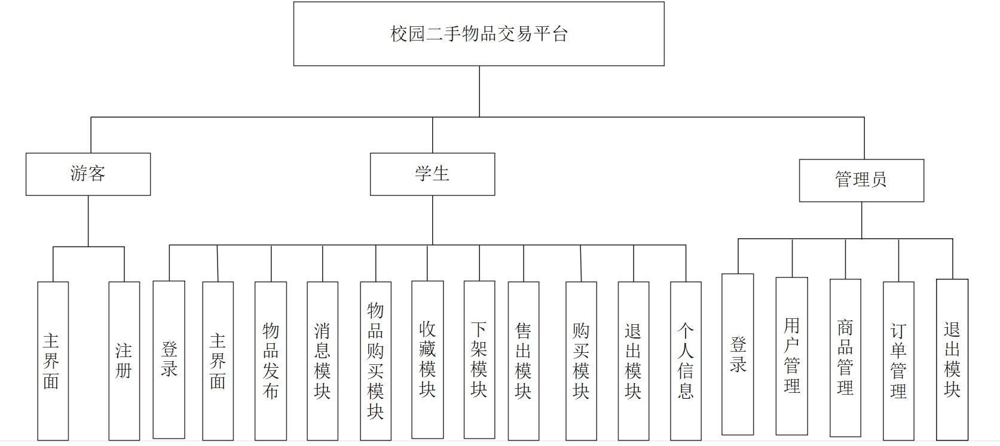
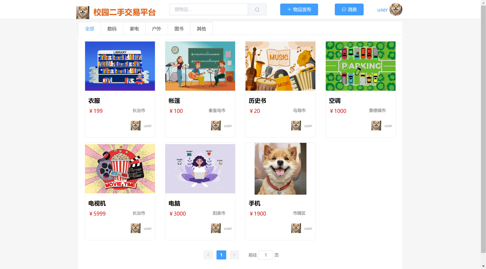
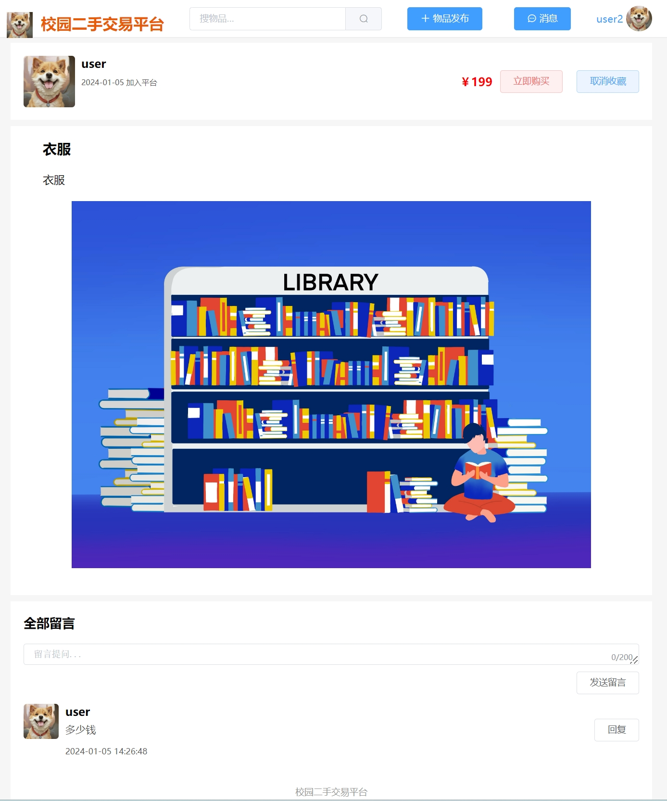
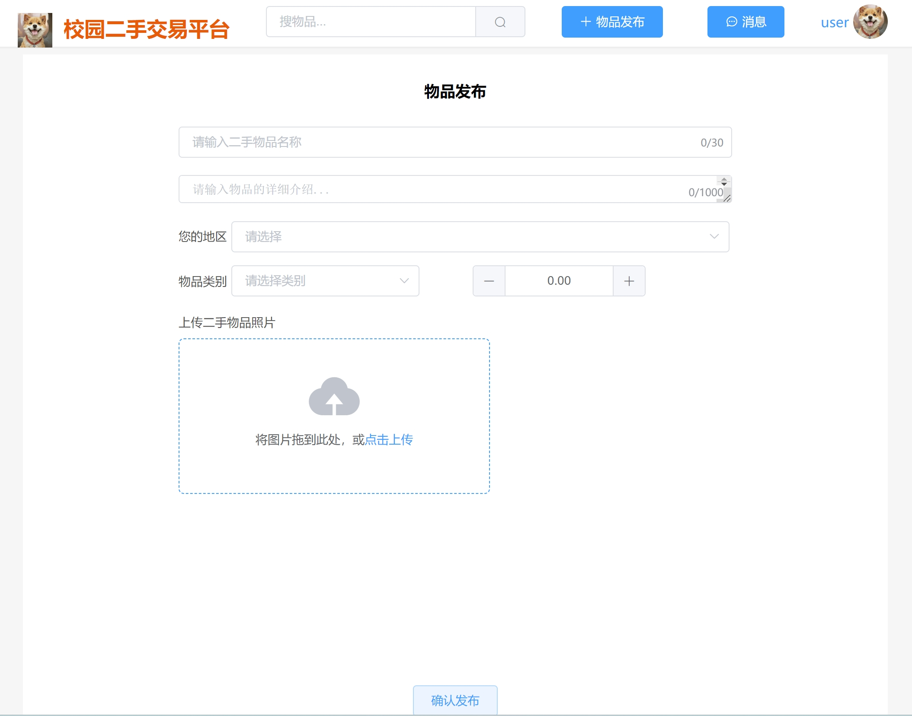
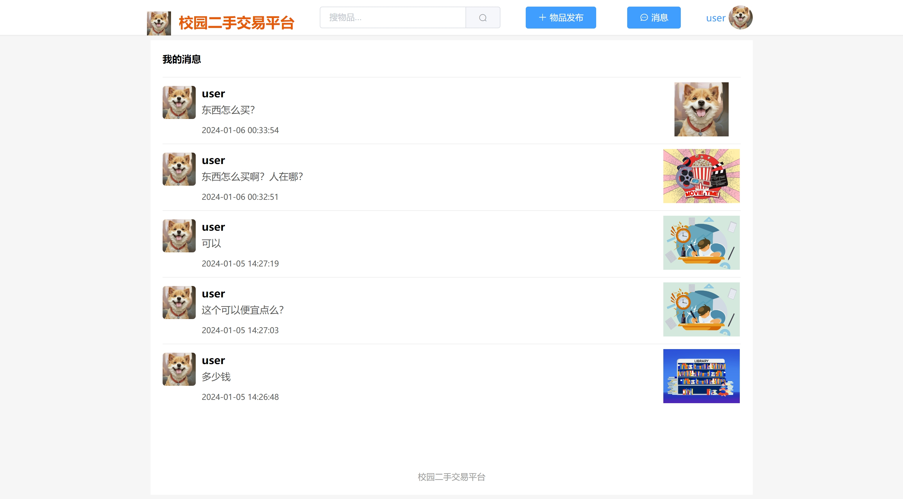
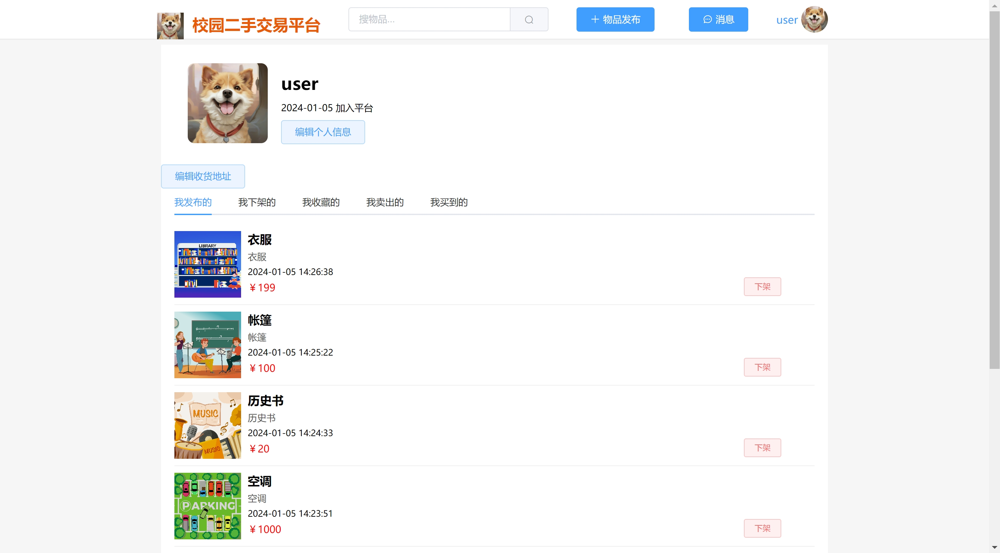
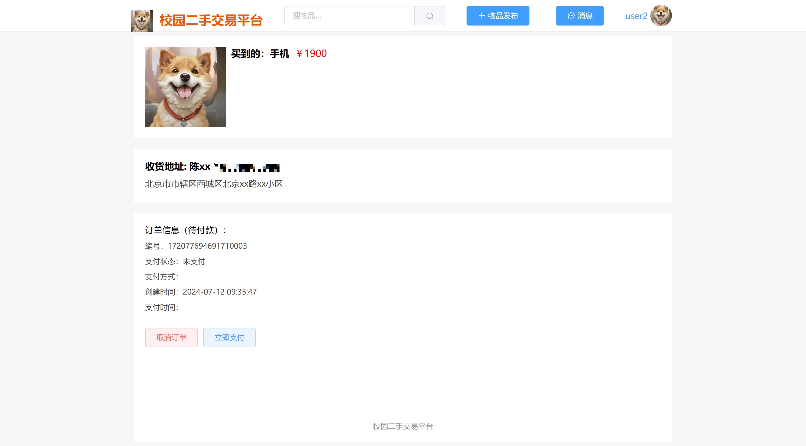
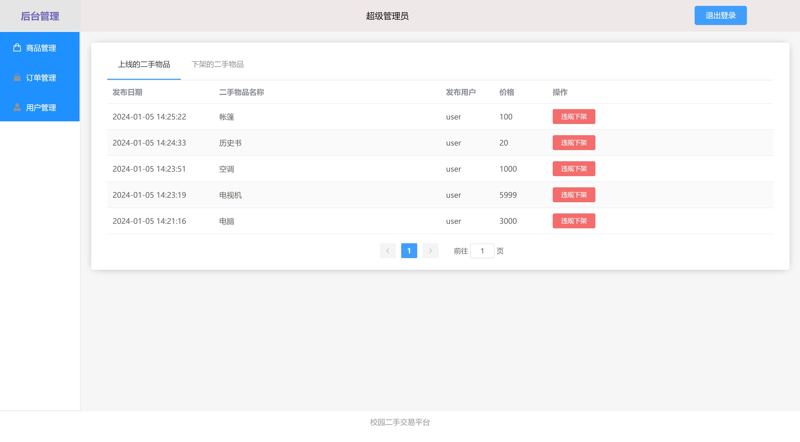
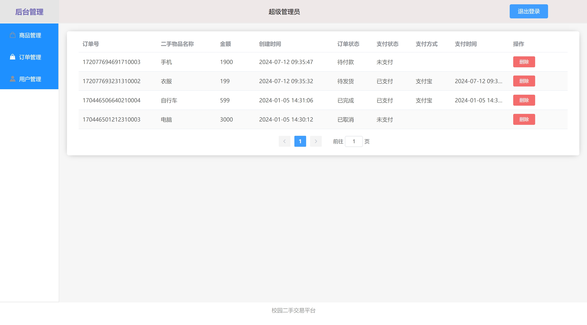

# springbootA046
springbootA046基于Java Springboot校园二手交易平台
 
## 查看主页获取源码

> **作者介绍**： **✌**全网粉丝10W+本平台特邀作者、博客专家、CSDN新星计划导师、java领域优质创作者,博客之星、掘金/华为云/阿里云/InfoQ等平台优质作者、专注于毕业项目实战 **✌**

  

### 一、作品包含

源码+数据库+设计文档+PPT+全套环境和工具资源+部署教程

### 二、项目技术

前端技术：Html、Css、Js、Vue、Element-ui

数据库：MySQL

后端技术：Java、Spring Boot、MyBatis

### 三、运行环境

开发工具：IDEA

数据库：MySQL8.0

数据库管理工具：Navicat10以上版本

环境配置软件： JDK1.8+Maven3.6.3

前端Nodejs：16

### 四、项目介绍
项目编号：springbootA046

游客：主界面、注册  
学生：登录、主界面、物品发布、消息模块、物品购买模块、收藏模块、下架模块、售出模块、购买模块、退出模块、个人信息 
管理员：登录、用户管理、商品管理、订单管理、退出模块

### 五、运行截图

